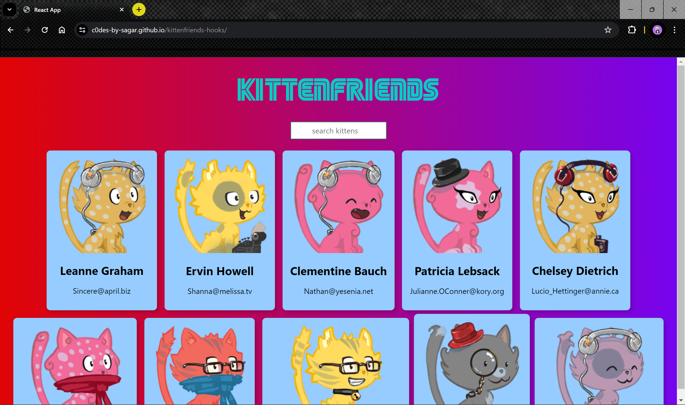

# Getting Started with Create React App

This project was bootstrapped with [Create React App](https://github.com/facebook/create-react-app).

**Preview:**

**Kitten Friends**

**Description:**
Kitten Friends is a simple React application that allows users to search for cute kitten images. Users can search for kittens by their name, and the app fetches kitten images from an API and displays them dynamically. This project serves as a fun way to practice React concepts like state management, component lifecycle, and API integration, utilizing React hooks for state management.

**Features:**
- Search for kitten images by name.
- Dynamic display of kitten images based on search query.
- Responsive design for seamless user experience across devices.
- Fetches data from the [Kitten API](https://thecatapi.com/).

**Demo:**
Check out the live demo of the app [kittenfriends-hooks](https://c0des-by-sagar.github.io/kittenfriends-hooks/).

**Installation:**
1. Clone the repository: `git clone https://github.com/C0des-by-SAGAR/kittenfriends.git`
2. Navigate to the project directory: `cd kittenfriends`
3. Install dependencies: `npm install`
4. Start the development server: `npm start`
5. Open your browser and visit `http://localhost:3000` to view the app.
   
**Usage:**
1. Enter a kitten name in the search bar.
2. Press enter or click the search button.
3. Enjoy browsing through adorable kitten images!

**Technologies Used:**
- React.js with Hooks
- JavaScript
- CSS
- HTML

**Credits:**
This project was created by [Sagar](https://github.com/C0des-by-SAGAR). The kitten images are fetched from the [Kitten API](https://thecatapi.com/).

**Contributing:**
Contributions are welcome! If you'd like to contribute to the project, feel free to submit a pull request.

**License:**
This project is licensed under the MIT License. See the [LICENSE](https://github.com/C0des-by-SAGAR/kittenfriends/blob/main/LICENSE) file for more details.

The repository is: https://github.com/C0des-by-SAGAR/kittenfriends-hooks
